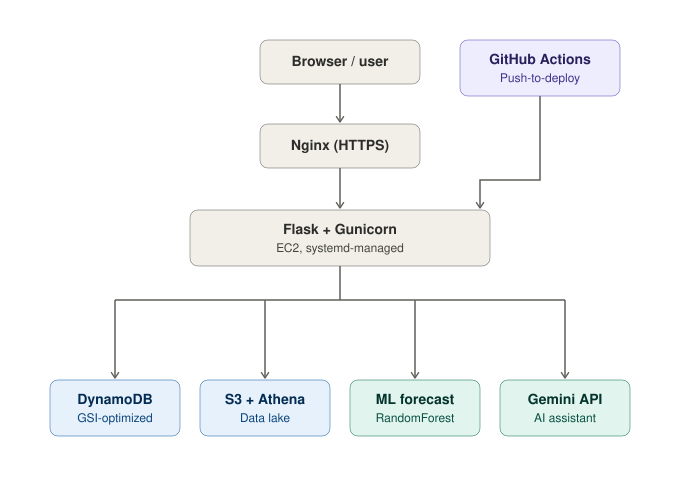

# 🌾 AgriCloud — Crop Yield Data Storage & Management Solution

**Live Demo:** https://cropyield.duckdns.org

A cloud-native, full-stack agricultural data platform originally built as an AWS capstone project and independently rebuilt into a production-grade application — real AWS services, measured performance improvements, CI/CD automation, and an LLM-powered agentic assistant.

---

## 📌 Overview

AgriCloud helps farmers log seasonal crop yield data and gives administrators platform-wide analytics — but the real story of this project is the engineering behind it. What started as a guided tutorial capstone was rebuilt phase-by-phase into a system with real security hardening, measured database performance tuning, an automated deployment pipeline, a trained ML forecasting model, and an agentic LLM assistant — all deployed and confirmed working on live infrastructure, not just running locally.

Every performance number below is a real measurement taken against the actual AWS resources — not an estimate.

---

## 🏗️ Architecture

Farmer / Admin (Browser)
&nbsp;&nbsp;&nbsp;&nbsp;&nbsp;&nbsp;&nbsp;&nbsp;│
&nbsp;&nbsp;&nbsp;&nbsp;&nbsp;&nbsp;&nbsp;&nbsp;▼
Nginx (reverse proxy, HTTPS via Let's Encrypt)
&nbsp;&nbsp;&nbsp;&nbsp;&nbsp;&nbsp;&nbsp;&nbsp;│
&nbsp;&nbsp;&nbsp;&nbsp;&nbsp;&nbsp;&nbsp;&nbsp;▼
Flask App (Gunicorn) — EC2 (Ubuntu, systemd-managed)
&nbsp;&nbsp;&nbsp;&nbsp;&nbsp;&nbsp;&nbsp;&nbsp;│
&nbsp;&nbsp;&nbsp;&nbsp;&nbsp;&nbsp;&nbsp;&nbsp;├──► DynamoDB (CropYield_Users, CropYield_Data + SeasonIndex GSI)
&nbsp;&nbsp;&nbsp;&nbsp;&nbsp;&nbsp;&nbsp;&nbsp;├──► S3 + Athena (partitioned data lake for analytics)
&nbsp;&nbsp;&nbsp;&nbsp;&nbsp;&nbsp;&nbsp;&nbsp;├──► RandomForest model (.pkl) — yield forecasting
&nbsp;&nbsp;&nbsp;&nbsp;&nbsp;&nbsp;&nbsp;&nbsp;├──► Google Gemini API — agentic natural-language assistant
&nbsp;&nbsp;&nbsp;&nbsp;&nbsp;&nbsp;&nbsp;&nbsp;└──► SNS — email notifications

GitHub Actions ──(on push to main)──► SSH deploy to EC2

---

## 🚀 Key Engineering Highlights

| Area | What Was Done | Real Measured Result |
|---|---|---|
| **Security** | Password hashing (Werkzeug/scrypt), env-based secrets, debug disabled | Production-safe auth |
| **Database Performance** | Added a DynamoDB GSI (`SeasonIndex`), rewrote admin dashboard to query instead of scan | **60.5% latency reduction** (4.192s → 1.654s) |
| **CI/CD** | GitHub Actions pipeline — push to `main` auto-deploys to EC2 | **13s automated deploy** vs ~20–25 min manual |
| **Analytics Pipeline** | S3 + Athena data lake (partitioned by season) vs raw DynamoDB scan+aggregate | **~83% faster (~5.9x)** for platform-wide aggregates |
| **ML Forecasting** | RandomForestRegressor trained on 19,689 real historical records (1997–2020, India-wide) | **R² = 0.9735**, Median APE = 20.52% |
| **Agentic AI Assistant** | Gemini function-calling loop routing across DynamoDB, Athena, and the ML model | 3 live tools, no hardcoded intent matching |
| **Infra** | Free custom domain (DuckDNS) + Nginx reverse proxy + free SSL (Let's Encrypt) | HTTPS, no exposed app port |

---

## ✨ Features

### 👨‍🌾 Farmer
- Secure signup/login (hashed passwords)
- Log crop yield records (crop, season, area, yield)
- View personal yield history
- **ML-powered yield forecast** for upcoming seasons, with historical trend chart
- **Ask-anything AI assistant** ("What was my average yield last Kharif season?")

### 🛠️ Admin
- Platform-wide analytics (Athena-backed, season/crop aggregates)
- User and record management
- Same forecasting + AI assistant, scoped to platform-wide data

---

## 🧠 The AI Assistant (Phase 6)

The `/assistant` route uses Google's `gemini-3.1-flash-lite` in a proper **agentic function-calling loop** — the model decides which tool(s) to call based on the question, executes them, and keeps calling tools until it has enough information for a final answer:

- `query_yield_data` → farmer's own records (DynamoDB, via the SeasonIndex GSI)
- `get_analytics` → platform-wide aggregates (Athena)
- `predict_yield` → wraps the trained forecast model (no retraining, reuses Phase 5's `.pkl`)

---

## 🧑‍💻 Tech Stack

| Layer | Technology |
|---|---|
| Backend | Flask (Python), Gunicorn |
| Database | Amazon DynamoDB (with GSI) |
| Analytics | Amazon S3 + Athena |
| ML | scikit-learn (RandomForestRegressor) |
| AI Assistant | Google Gemini API (`google-genai`, function calling) |
| Infra | AWS EC2 (Ubuntu), IAM roles, SNS |
| CI/CD | GitHub Actions |
| Domain/SSL | DuckDNS + Nginx + Let's Encrypt (Certbot) |
| Frontend | HTML5, CSS3, JavaScript, Chart.js |

---

## 📂 Engineering Journey (Phase by Phase)

1. **Repo Cleanup & Security** — password hashing, env-based secrets, `debug=False`
2. **DynamoDB Performance** — SeasonIndex GSI, 60.5% measured latency improvement
3. **CI/CD Pipeline** — GitHub Actions, 13s automated deploys; later hardened with `set -e` + `git reset --hard` + post-deploy health checks after a silent-failure bug was caught and fixed in production
4. **S3 + Athena Data Lake** — partitioned analytics pipeline, ~83% faster aggregates
5. **ML Yield Forecasting** — RandomForest on 19,689 real Kaggle records, time-based train/test split to avoid leakage
6. **Agentic AI Assistant** — Gemini function-calling across DynamoDB/Athena/ML model
7. **Production Polish** — free custom domain, Nginx reverse proxy, free SSL, this README

**A real bug worth mentioning:** for several deploys, GitHub Actions reported green checkmarks while the live site silently stayed on an old commit — a local uncommitted change on the EC2 server was blocking `git pull`, and the deploy script had no `set -e` to catch it. Fixed by switching to `git fetch && git reset --hard origin/main` and adding a post-restart health check that fails the job loudly instead of reporting false success.

---

## ⚙️ Local Setup

1. Clone the repo:
   `git clone https://github.com/prashant-rai99/crop-yield-aws-capstone.git`
2. Move into the app folder:
   `cd crop-yield-aws-capstone/Crop_Yield_Data_Storage_and_Management_Solution`
3. Create and activate a virtual environment:
   `python -m venv venv` then `source venv/bin/activate` (or `venv\Scripts\activate` on Windows)
4. Install dependencies:
   `pip install -r requirements.txt`
5. Create a `.env` file with: `FLASK_SECRET_KEY`, `SNS_TOPIC_ARN`, `GEMINI_API_KEY` — plus AWS credentials configured (`aws configure`) for DynamoDB/S3/Athena access
6. Run the app:
   `python app_aws.py`

---

## 👤 Author

**Prashant Rai** (Prishu)
B.Tech CSE (AI), KIET Group of Institutions
🔗 [GitHub](https://github.com/prashant-rai99)